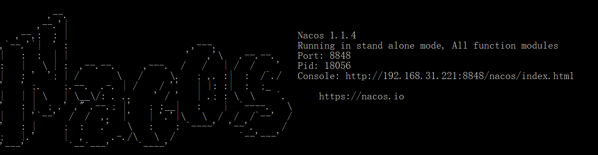
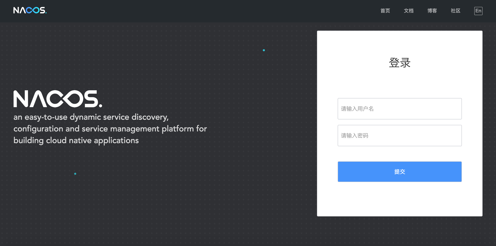
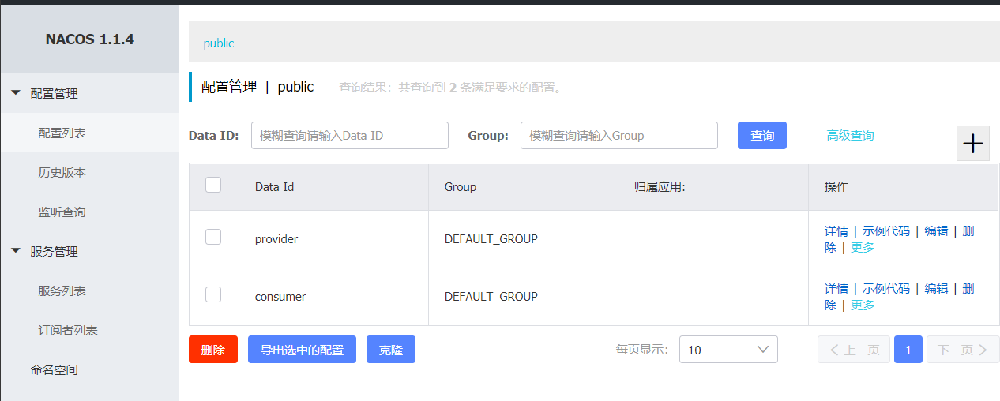
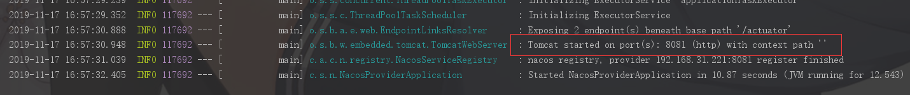
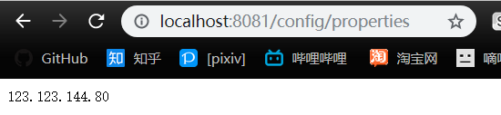
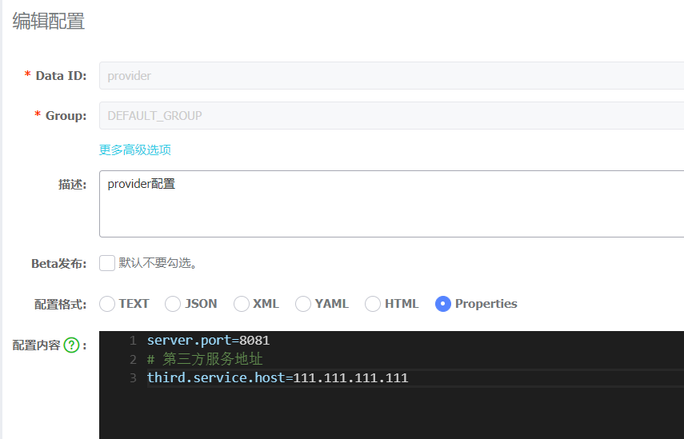
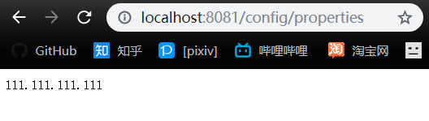

# Nacos学习

使用nacos作为spring cloud项目的配置服务和服务注册中心

[TOC]


## 项目结构
包含两个子项目：

- nacos-provider: 服务提供者
- nacos-consumer: 服务调用者

## 开始之前

### 下载并启动nacos

在开始之前，先[下载nacos](https://github.com/alibaba/nacos/releases/download/1.1.4/nacos-server-1.1.4.zip)到本机，使用bin目录下的启动脚本启动。默认情况下,nacos会以单机模式启动。可以看到nacos还提供了一个控制台。



访问 http://localhost:8848/nacos/index.html 可以看到控制台。默认的用户名密码为 nacos/nacos。



详细的控制台使用手册见 [nacos控制台手册](https://nacos.io/zh-cn/docs/console-guide.html)

### Spring Cloud Bootstrap配置文件

Spring Cloud提供了一个bootstrap.properties(bootstrap.yml)的配置文件。这个配置文件用于引导程序启动，在spring程序正式启动之前，可以根据这个配置中提供的信息去进行应用中的配置读取。

nacos的服务注册中心地址就需要配置在这个地方。

### 使用的版本

```properties
spring: Hoxton.RC2
nacos: 1.1.4
```

以下所有的演示都只在本机，使用本机模拟分布式的环境。一开始将使用单机模式进行演示。

## 配置服务使用

### 创建配置

首先我们在nacos的控制台中新增两个类型为**properties**的配置: provider和consumer, 代表这是provider和consumer两种服务的配置。

**这个配置的名称(Data Id)不能随便起，会关系到spring cloud项目能否读取到这个配置。**




配置的内容如下

```properties
#### provider配置
server.port=8081
# 假定有这么一个第三方服务，其地址为
third.service.host=123.123.144.80

#### consumer配置
server.port=8899
```

### 配置服务注册

在provider的bootstrap.properties文件中，增加配置中心的地址以及应用的名称

```properties

spring.cloud.nacos.config.server-addr=localhost:8848
# 这个应用的名称也是必须配置的
spring.application.name=provider
```

注意，应用的名称是必须要进行配置的，默认情况下，spring cloud项目会读取Data Id为以下规则的配置

```
${prefix}-${spring.profile.active}.${file-extension}
```

默认情况下，prefix的值即为`spring.application.name`的值。也可以通过配置项 `spring.cloud.nacos.config.prefix`来修改prefix。

配置ok之后，让我们启动一下provider项目，可以看到，我们没在application.properties里配置tomcat的端口，应用按照nacos上配置的服务端口启动了。说明配置生效了。



### 配置注入与自动更新

在nacos配置的配置项可以像在application.properties中的配置项一样注入到程序中。

现在我们给provider增加一个配置类和一个controller接口，以展示配置是否成功注入。

```java
// 配置类
@Component
@RefreshScope // 启用配置自动刷新
@Data // 这是个lombok的注解，将自动给类添加getter和setter。需要在idea中安装lombok插件以避免后边找不到getter setter的报错。
public class ConfigProperties {

    @Value("${third.service.host}")
    private String thirdServiceHost;

}
```

把刚刚我们假定的第三方服务配置注入到这个配置类中。

另外，还为其加上一个@RefreshScope的注解，这是一个Spring Cloud的注解，Nacos支持了这个注解，使得配置发生变更时，注入的值能及时变更。

```java
// 配置的controller接口
@RestController
@RequestMapping("/config")
public class PropertyController {

    @Autowired
    private ConfigProperties configProperties;

    @GetMapping("properties")
    public String getProperties() {
        return configProperties.getThirdServiceHost();
    }

}

```

现在启动项目，访问http://localhost:8081/config/properties



然后我们在nacos上修改一下配置, 点击发布。



再次访问 http://localhost:8081/config/properties



可以看到配置及时地发生了变更。