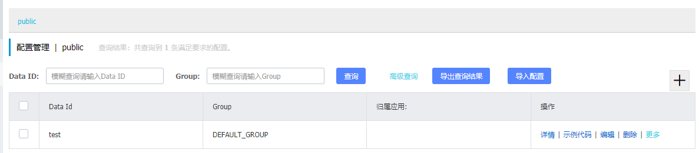

# Nacos学习

使用nacos作为spring cloud项目的配置服务和服务注册中心

[TOC]


## 项目结构
包含两个子项目：

- nacos-provider: 服务提供者
- nacos-consumer: 服务调用者

## 开始之前

### 下载并启动nacos

在开始之前，先[下载nacos](https://github.com/alibaba/nacos/releases/download/1.1.4/nacos-server-1.1.4.zip)到本机，使用bin目录下的启动脚本启动。默认情况下,nacos会以单机模式启动。可以看到nacos还提供了一个控制台。


访问 http://localhost:8848/nacos/index.html 可以看到控制台。默认的用户名密码为 nacos/nacos。


详细的控制台使用手册见 [nacos控制台手册](https://nacos.io/zh-cn/docs/console-guide.html)

### Spring Cloud Bootstrap配置文件

Spring Cloud提供了一个bootstrap.properties(bootstrap.yml)的配置文件。这个配置文件用于引导程序启动，在spring程序正式启动之前，可以根据这个配置中提供的信息去进行应用中的配置读取。

nacos的服务注册中心地址就需要配置在这个地方。

### 使用的版本

```properties
spring: Hoxton.RC2
nacos: 1.1.4
# 某名奇妙地discovery下不了2.1.1.RELEASE的版本，但2.1.0.RELEASE版本却可以
spring-cloud-starter-alibaba-nacos-discovery: 2.1.0.RELEASE
spring-cloud-starter-alibaba-nacos-config: 2.1.1.RELEASE 
```

以下所有的演示都只在本机，使用本机模拟分布式的环境。一开始将使用单机模式进行演示。

### 安装mysql

nacos默认采用嵌入式的数据库，如果要在生产环境使用，官方建议采用mysql作为数据库。

[mysql windows 下载地址](https://dev.mysql.com/downloads/windows/installer/5.7.html)

## 配置服务使用

### 创建配置

首先在nacos的控制台中新增两个类型为**properties**的配置: provider和consumer, 代表这是provider和consumer两种服务的配置。

**这个配置的名称(Data Id)不能随便起，会关系到spring cloud项目能否读取到这个配置。**


在provider中增加如下配置

```properties
#### provider配置
server.port=8081
# 假定有这么一个第三方服务，其地址为
third.service.host=123.123.144.80

#### consumer配置
server.port=8899
```

### 配置服务注册

在provider的bootstrap.properties文件中，增加配置中心的地址以及应用的名称

```properties

spring.cloud.nacos.config.server-addr=localhost:8848
# 这个应用的名称也是必须配置的
spring.application.name=provider
```

注意，应用的名称是必须要进行配置的，默认情况下，spring cloud项目会读取Data Id为以下规则的配置

```
${prefix}-${spring.profile.active}.${file-extension}
```

默认情况下，prefix的值即为`spring.application.name`的值。也可以通过配置项 `spring.cloud.nacos.config.prefix`来修改prefix。

配置ok之后，启动一下provider项目，可以看到，我们没在application.properties里配置tomcat的端口，应用按照nacos上配置的服务端口启动了。说明配置生效了。


### 配置注入与自动更新

在nacos配置的配置项可以像在application.properties中的配置项一样注入到程序中。

现在给provider增加一个配置类和一个controller接口，以展示配置是否成功注入。

```java
// 配置类
@Component
@RefreshScope // 启用配置自动刷新
@Data // 这是个lombok的注解，将自动给类添加getter和setter。需要在idea中安装lombok插件以避免后边找不到getter setter的报错。
public class ConfigProperties {

    @Value("${third.service.host}")
    private String thirdServiceHost;

}
```

把刚刚我们假定的第三方服务配置注入到这个配置类中。

另外，还为其加上一个@RefreshScope的注解，这是一个Spring Cloud的注解，Nacos支持了这个注解，使得配置发生变更时，注入的值能及时变更。

```java
// 配置的controller接口
@RestController
@RequestMapping("/config")
public class PropertyController {

    @Autowired
    private ConfigProperties configProperties;

    @GetMapping("properties")
    public String getProperties() {
        return configProperties.getThirdServiceHost();
    }

}

```

现在启动项目，访问http://localhost:8081/config/properties


然后我们在nacos上修改一下配置, 点击发布。


再次访问 http://localhost:8081/config/properties


可以看到配置及时地发生了变更。

### 配置变更监听

当配置发生变更的时候，有时候我们可能会想做一些额外的事情，比如记录一下log。nacos提供了对配置变更事件的监听，但目前官方文档中的方式在当前版本(**nacos-spring-cloud-cofig 2.1.1.RELEASE**)并不支持在spring cloud下使用。以下是相关的issued

- <https://github.com/alibaba/spring-cloud-alibaba/issues/830>
- <https://github.com/alibaba/spring-cloud-alibaba/issues/825>

目前可以采用监听spring事件的方式实现,方法来自[Spring Cloud @RefreshScope和@EventListener实现Nacos配置更新监听](<http://appblog.cn/2019/09/18/Spring%20Cloud%20@RefreshScope%E5%92%8C@EventListener%E5%AE%9E%E7%8E%B0Nacos%E9%85%8D%E7%BD%AE%E6%9B%B4%E6%96%B0%E7%9B%91%E5%90%AC/>)

现在我们给ConfigProperties类添加一个对EnvironmentChangeEvent的监听事件, 并注入Spring的Environment以便拿到变化后的值

```java
@Component
@RefreshScope
@Data
@Slf4j // lombok的注解，将自动生成一个log field
public class ConfigProperties {

    @Value("${third.service.host}")
    private String thirdServiceHost;

    @Value("${local.id}")
    private String localID;

    // 注入Environment以便拿到变化后的值
    @Autowired
    private Environment env;

    // 目前版本暂时不支持
    @NacosConfigListener(dataId = "provider")
    public void onMessage(Properties config) {
        log.info("config changed: {}", config);
    }

    @EventListener(EnvironmentChangeEvent.class)
    public void refreshEvent(EnvironmentChangeEvent event) {
        StringBuilder mes = new StringBuilder();
        mes.append("listening config event\n");

        // 遍历所有变化后的key,从environment中拿到值并输出
        for (String key : event.getKeys()) {
            mes.append("changed properties key=").append(key).append(", new value=").append(env.getProperty(key)).append("\n");
        }

        log.info(mes.toString());
    }
}
```

现在，让我们再更改一下nacos上的配置的值，从控制台可以看到Nacos监听到了变更，并打印了变更的值。我们自定义的EventListener也打印出相应的输出。但@NacosConfigListener并没有生效。


## 服务注册中心

### 服务接入

服务接入nacos非常简单，只要在bootstrap.properties中加入nacos的地址和应用的名称即可。

前边在provider的bootstrap.properties文件中已经加入了这个配置。

```properties
spring.cloud.nacos.config.server-addr=localhost:8848
# 这个应用的名称也是必须配置的
spring.application.name=provider
```

打开nacos的控制台，可以看到服务已经注册到nacos上。


### openfeign服务调用与负载均衡

nacos支持spring cloud的open feign服务调用，可以用原生的open feign方式调用微服务，不需要额外修改代码。

现在，在provider上增加一个模拟的服务的接口，这个服务打印出一段hello world消息。后边将会启动2个provider服务。

```java
@RestController
@RequestMapping("/hello")
@Slf4j
public class HelloController {

    @Autowired
    private ConfigProperties properties;

    @GetMapping("sayHello")
    public String sayHello(@RequestParam String greet) {
        log.info("greet received {}", greet);
        return "Hello world from: " + properties.getLocalID();
    }
}
```

为测试openfeign的负载均衡功能，我们增加了一个配置属性local-id，以区分具体是哪个服务返回的消息。

```properties
# application.properties文件

## 第一个provider
### 在本地模拟时，为启动多个provider,需要先去掉nacos上的server.port配置
server.port=8081 
local.id=provider A

## 第二个provider
server.port=8082
local.id=provider B
```

然后在consumer中增加一个接口来调用provider服务

```java
// ServiceController.java
@RestController
@RequestMapping("/hello")
public class ServiceController {

    @Autowired
    private HelloApi helloApi;

    @GetMapping("/sayHello")
    public String sayHello(@RequestParam String greet){
        return helloApi.sayHello(greet);
    }
}

// HelloApi.java
@Component
@FeignClient(name="provider") // 被调用的服务名
public interface HelloApi {

    @GetMapping("/hello/sayHello")
    String sayHello(@RequestParam("greet") String greet);
}
```

并在nacos上增加consumer的配置

```properties
server.port=8899
```

完成后，可以把provider和consumer一起启动了。使用idea在本地模拟分布式时，要启动2个provider, 可以启动完第一个后，修改一下provider配置中的server.port，再启动第二个。

这个时候nacos上将会出现2组3个服务


接着多次访问 <http://localhost:8899/hello/sayHello?greet=hello>，可以看到以下2种输出


### hystrix熔断

如果远端的服务不可用时，需要有快速失败的机制防止服务雪崩。open feign的hystrix熔断在nacos下使用方式和原生的也是一样的。

现在，给consumer增加一个hystrix。增加的方式是直接实现open feign的接口。

```java
@Component
public class HelloApiHystrix implements HelloApi {

    @Override
    public String sayHello(@RequestParam("greet") String greet) {
        return "the provider has crashed! service currently unavailable";
    }
}
```

并在原HelloApi上，增加fallback属性

```java
@Component
@FeignClient(name="provider", fallback = HelloApiHystrix.class)
public interface HelloApi {

    @GetMapping("/hello/sayHello")
    String sayHello(@RequestParam("greet") String greet);
}
```

要测试服务全部崩溃的情况，可以用nacos控制台的服务上线、下线功能。此功能并不是真的将服务关掉，而是将服务从可调用的列表中排除掉。

将2个provider全部下线


这个时候继续去访问http://localhost:8899/hello/sayHello?greet=hello


可以看到快速失败完成。

只上线一个服务


不管访问几次，都只有一个provider提供调用


可能会出现把服务下线之后, 依旧能够调用到服务的情况。因为spring-cloud-nacos会每隔一段时间去获取可用的服务地址，默认间隔为30s，可以在boostrap.properties中修改以下配置以修改时间。

```properties
spring.cloud.nacos.discovery.watch-delay=30000
```


## 使用mysql作为数据库
默认情况下，nacos采用**Derby**嵌入式数据库。nacos官方建议在生产环境采用高可用数据库，位于nacos目录下的**conf/nacos-mysql.sql**为官方提供的建库脚本。

登录mysql, 使用以下命令将nacos建库语句导入

```mysql
create database nacos; # 可以改为你自己想要的数据库名
use nacos;
source /path/to/nacos/conf/nacos-mysql.sql
```

导入完成后，修改nacos目录下的**conf/application.properties**,加入以下的配置来配置mysql数据库

```properties
spring.datasource.platform=mysql

db.num=1
# url、用户名密码根据你自己的情况修改
db.url.0=jdbc:mysql://localhost:3306/nacos?characterEncoding=utf8&connectTimeout=1000&socketTimeout=3000&autoReconnect=true
db.user=root
db.password=root
```

修改完以上配置后，启动/重启 nacos，往配置列表中加入一个配置。



在mysql中进行查询，看到相应的记录，说明数据库已经成功切换到mysql。


注意的是，nacos并不会自动将嵌入式的数据库中的记录迁移到mysql中。如果有旧版本的配置，需要手动迁移。


### 多数据库做主备

如果有多个数据库做主备，配置方法和spring中配置多数据库的方法一致。

```properties
## 配置实例
# 有几个数据库实例
db.num=2
# 第1个数据库实例的地址
db.url.0=jdbc:mysql://192.168.56.101:3306/nacos_devtest?characterEncoding=utf8&connectTimeout=1000&socketTimeout=3000&autoReconnect=true
# 第2个数据库实例的地址
db.url.1=jdbc:mysql://192.168.56.102:3306/nacos_devtest?characterEncoding=utf8&connectTimeout=1000&socketTimeout=3000&autoReconnect=true

```

## 集群部署

### nacos集群配置

集群部署需要修改nacos的集群配置文件。

nacos目录下有个**conf/cluster.conf.example**集群配置文件示例。默认情况下集群部署是不开启的。复制该文件，重命名为cluster.conf。往配置中增加集群的ip。

```properties
#it is ip
#example
localhost:8848
localhost:8898
```

因为使用本机测试，所以这里的ip都是localhost。

本机测试时，可以将nacos复制多份，分别修改nacos配置文件**application.properties**中的端口为不同的2个端口，以在本机启动2个实例。

```properties
# 第一个实例
server.port=8848

# 第二个实例
server.port=8898
```

在windows下启动时，默认情况下是以单机模式启动的（linux默认以集群模式启动）,启动需要增加参数以支持集群模式。

```bash
startup.cmd -m cluster
```

这个时候启动可以看到启动打印出了集群的ip


访问其中的一个实例，在节点列表里可以看到集群里已经有2个实例。


### 集群下服务接入


## nacos权限控制

目前版本(1.1.3)nacos仅支持简单的用户名密码权限控制，虽然有roles这张表，但还没有用上。

官方issue中有未来增加权限控制的计划，可以追踪[#1105](https://github.com/alibaba/nacos/issues/1105)此issue

### 增加用户

控制台目前的版本不支持增加用户，需要手动往mysql中插入用户的记录。

nacos源码中的 [PasswordEncoderUtil ](https://github.com/alibaba/nacos/blob/develop/console/src/main/java/com/alibaba/nacos/console/utils/PasswordEncoderUtil.java) (位于com.alibaba.nacos.console.utils.PasswordEncoderUtil.main)用来加密密码，可以将此源码复制到spring项目中执行生成用户的密码。

```java
import org.springframework.security.crypto.bcrypt.BCryptPasswordEncoder;

/**
 * Password encoder tool
 *
 * @author nacos
 */
public class PasswordEncoderUtil {

    public static void main(String[] args) {
        System.out.println(new BCryptPasswordEncoder().encode("nacos"));
    }

    public static Boolean matches(String raw, String encoded) {
        return new BCryptPasswordEncoder().matches(raw, encoded);
    }

    public static String encode(String raw) {
        return new BCryptPasswordEncoder().encode(raw);
    }
}
```

用以上代码加密密码 **test** , 往mysql中插入一条记录

```mysql
INSERT INTO users (username, password, enabled) VALUES ('test', '$2a$10$0qXCjb0bBtWNcCUJAEC3KuJM1O3Z034N7bdZmrv/9h5mvfLKlwhLa', TRUE);
INSERT INTO roles (username, role) VALUES ('test', 'ROLE_ADMIN');
```

使用此账号成功登录


## 参考文章

1. [nacos官网](https://nacos.io/zh-cn/index.html)
2. [spring boot系列文章 - 纯洁的微笑](http://www.ityouknow.com/spring-boot.html)
3. [nacos github](https://github.com/alibaba/nacos)